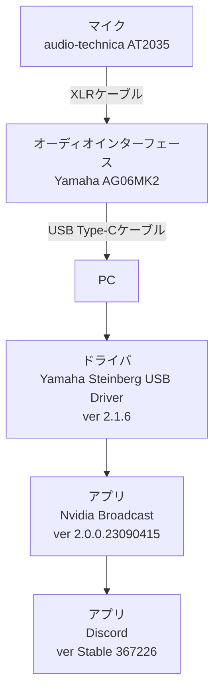

## 各種環境

* OS
  Windows 11
* CPU
  Ryzen9 7950X3D
* RAM
  DDR5 64GB
* GPU
  GeForce RTX 3080

### デバイス構成



## 問題

PCがスリープから復帰したあと`Discord`や`NVIDIA Broadcast`含め全てのアプリに音声が入力されません。(インジケータが微動だにしない)
PCをシャットダウンまたはオーディオインターフェースの電源を一度オフにして、オンにすると音声入力できます。

自分の場合は`AG06MK2`で再現しましたが、`AG03`、`AG06`、`AG03MK2`でも再現するかもしれません。

## 解決

Nvidia Broadcastの2.0.0.23090415と相性が悪いです。1.4.0.29にダウングレードしましょう。ただ、1.4.0.29であってもスリープから復帰した後アプリを再起動しなければ音声入力しない場合が多いです。
物理電源をオンオフする手間とアプリを再起動する手間だと再起動の方が楽かなと思います。

* [AG06MK2 AG03MK2 セーフティガイド](https://jp.yamaha.com/files/download/other_assets/2/1545192/ag0603mk2_ja_sg_b0.pdf)

AG06MK2のマニュアルを見るとPCの電源を切る前にオーディオインターフェースの電源をオフに、PCの電源を入れてからオーディオインターフェースの電源をオンにするようといった趣旨のことが書かれている気がするので、そもそも入れっぱなしはよくないようです。

### Nvidia Broadcastのダウンロード先

* [2.xシリーズ](https://www.nvidia.com/ja-jp/geforce/broadcasting/broadcast-app/)
* [1.4.0.29](https://www.nvidia.com/ja-jp/design-visualization/software/broadcast-app/)

### Nvidia Broadcastの再起動スクリプト

毎回手動で再起動するのは手間なので、スクリプトにしておくとちょっと楽です。
タスクスケジューラに登録しておいてもいい気もします。

`NVIDIA Broadcast.exe`が複数プロセス動いている場合があったので、数回実行させています。複数回実行しても特に害はないですが、気になる場合は環境に合わせて修正してもよいと思います。

```bash:restart-nvidia-broadcast.bat
@echo off

taskkill /im "NVIDIA Broadcast.exe" /F
taskkill /im "NVIDIA Broadcast.exe" /F
taskkill /im "NVIDIA Broadcast.exe" /F
taskkill /im "NVIDIA Broadcast.exe" /F
taskkill /im "NVIDIA Broadcast.exe" /F

taskkill /im "NVIDIA Broadcast UI.exe" /F
taskkill /im "NVIDIA Broadcast UI.exe" /F

start "" "C:\Program Files\NVIDIA Corporation\NVIDIA Broadcast\NVIDIA Broadcast UI.exe"
```

## その他のトラブルシューティング

### オーディオインターフェースの電源は入るのにデバイス自体をPCで認識しない

Type-Cケーブルの接続口が間違っている可能性があります。
オーディオインターフェースの背面の`USB 2.0`ポートに接続しましょう。
`5V DC`ポートは電源供給のみで通信を行いません。
