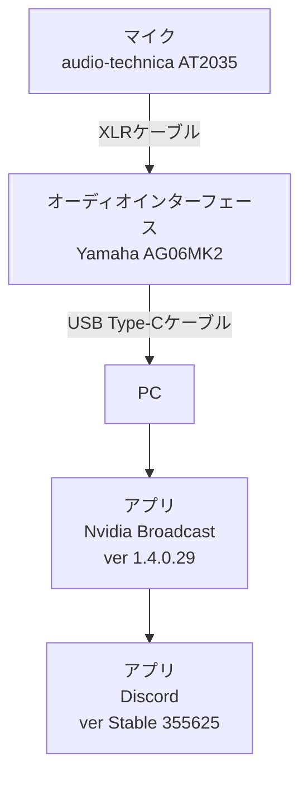

## 各種環境

### PC構成

* OS
  Windows 11
* CPU
  Ryzen9 7950X3D
* RAM
  DDR5 64GB
* GPU
  GeForce RTX 3080

### デバイス構成

### Nvidia Broadcast設定

ノイズ除去エフェクト有効化、強度最高

## 問題

Yamaha AG06MK2で処理された音声にはノイズはありませんが、Nvidia Broadcastで処理された後にノイズが入ります。
ここでいうノイズというのはキーボードのタイプ音などのような環境音ではなく、マイク入力された時点では存在しないノイズをさします。

### ノイズの例

以下の動画でノイズを確認できます。
AG06MK2処理後の音声のみの入力ですが、Nvidia Broadcast処理後は「ﾌﾞﾂｯ」というノイズが入っています。

* Yamaha AG06MK2処理後の音声

https://www.youtube.com/watch?v=tlemw5h9bao

* Nvidia Broadcast処理後の音声

https://www.youtube.com/watch?v=u4sgnNke56s

* Yamaha AG06MK2, Nvidia Broadcastを重ねた音声

https://www.youtube.com/watch?v=4Is3kU5cHQk

### 問題が再現する状況の詳細

Escape From Tarkovというゲームをプレイ中にDiscordで音声通話をしているとフレンドからノイズが入っていると言われて気が付きました。
マイク入力なので当然自分で普段から聞くことはないため全く気が付けませんでした。

### 解決までのプロセス

問題の切り分けのためOBSにてYamaha AG06MK2の入力音声トラック、Nvidia Broadcastの入力音声トラックを分けて録画しました。

* Yamaha AG06MK2処理後にノイズが入っていればマイクかオーディオインターフェース、ケーブルのトラブル
* Nvidia Broadcast処理後にノイズが入っていればGPUかNvidia Broadcastアプリ、PC周りのトラブル
* どちらにもノイズが入っていなければDiscordアプリか通信環境、相手側のトラブル

余談ですが、同時に変化のある画面(ゲームなど)も記録しておくと、後でノイズの箇所を振り返るときにわかりやすいです。
録画している際にDiscordで通話しているフレンドに「ノイズが入ったら教えて」と伝えて、ノイズが入ったタイミングのシーンや発音をメモしておきます。

録音した結果、Yamaha AG06MK2処理後は問題なく、Nvidia Broadcast処理後にノイズが入っていることがわかりました。
グラボのドライバ更新などやってみましたが、特に解決はしないためタスクマネージャを眺めつつ傾向を見るとGPU使用率が100%近い時に起こりやすそうだと気が付きました。

いつもゲーム中にTwitchやYoutubeを複窓で視聴しています。
Google Chromeが常にGPU使用率30~40%使用しているところに、ゲームで追加負荷がかかると使用率が100%に達してノイズが乗っていたという具合でした。

## 解決

GPU使用率に余裕を持たせます。
GPU使用率が100%になり、処理しきれなくなったときにノイズが入るようです。

「TwitchやYoutubeを止めたくない！」という場合は再生する解像度を下げるとGPU負荷を下げることが出来ます。
具体的には、Twitchを1080p60fpsで5窓するとGPU負荷は30~40%かかりますが、160pに変更することで3%程度抑えることが出来ます。

## 参考文献

* [ffmpegでm4aをYouTubeにアップロードできるmp4に変換する方法](https://zenn.dev/rebi/articles/fee92f031a146e)
  Audacityで切り出した音声をYoutubeにアップロードする際に参考にしました。
